# Welcome to BlackJack

### [Github Repo](https://github.com/DjSeth1/DivijSeth_T1A3)
### [Source Control Repo](https://github.com/DjSeth1/DivijSeth_T1A3/commits/main)
### [Presentation]()

## Statement of Purpose and Scope
This is a terminal implementation of the beloved game of Blackjack. It follows a similar variation from what is played at Casinos far and wide. This implementation encompasses the full scope of the concepts learned so far in Python, and is reflective of the skills attained.

## Target Audience
It is intended or people looking to play a game in the vintage setting of the command line, as well as all blackjack lovers, who seek the thrill of advancing their tactics against the dealer.

## How the Game Works
- The game is coded to mimic a real blackjack game at a casino.
- Winning Odds and losing odds all mimic the same as a casino.
- Upon Launching the app. The user is greeted, and prompted to input their name and deposit.
- Once the user has deposited, they can choose to bet an amount less than their deposit to start the game.
- Hands for dealers and players are dealt from the Deck Class where the Card class generates each card that go into the Deck, which then go into the player or dealers hands.
- The round plays with all the relevant information being displayed using the GUI.
- The round ends at the result of many defined outcomes, and then the user is prompted to play again given they have enough balance.

## Visual Aspects of How the Game is Played

The game starts and the user is prompted to input their name:
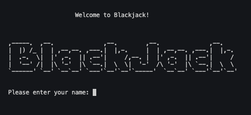

Then the user is prompted to input their bets:
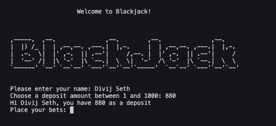

After this, the round begins and cards are dealt, the GUI displays the cards, as well as their values:
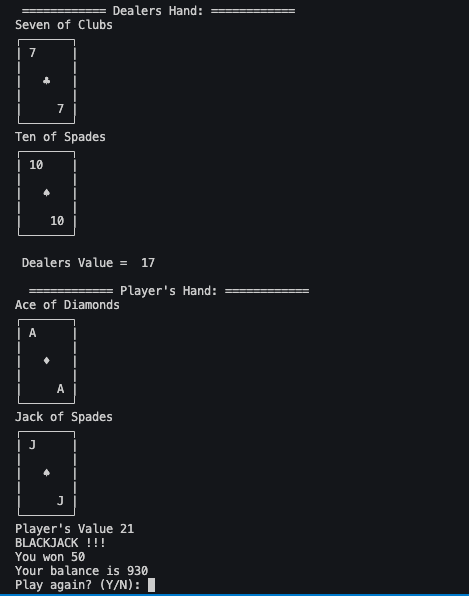

The user can choose to hit or stand and control the flow of their game from here on out. 
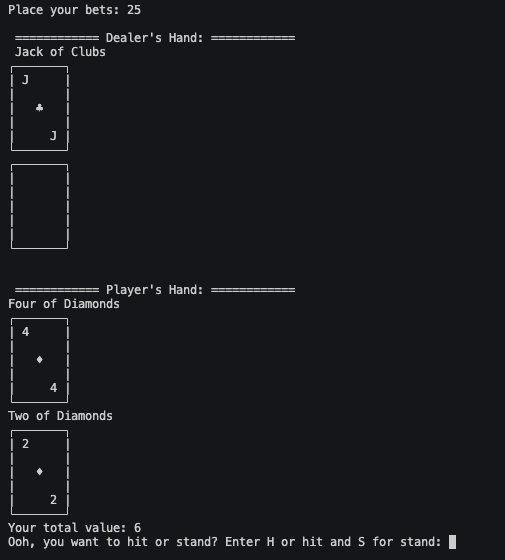

After the round finishes, user can choose to play or not play again depending on their balance amount.
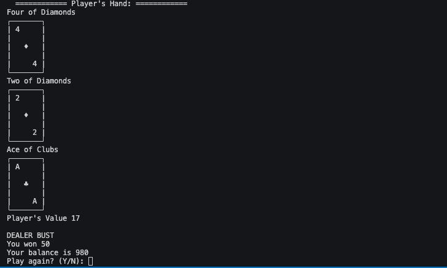

## Features

All the features outlined have a vast variety of conditionals, loops and variable scopes that work together to create a seamless and fun user experience.While this game encompasses a vast variety of features which are outlined in other deliverables of this project, the three I will outline in this document are as follows. 

### Betting Functionality  Feature

Users will be able to put their talents and luck to the test with the betting option, offering them the opportunity to improve their fortunes. They will be able to stake any amounts that fall within their deposit limits and receive the proper payout based on the odds.

### GUI display of Cards Feature

It's a card game, so the user can expect to see some cards being displayed. The programme has a graphical user interface that provides crucial information such as user balance and bets, as well as game outcomes and hand values creating a visually appealing experience.

### Hit or Stand Feature

Users can utilise the **hit** function to draw another single card to add to their hand. When the user enters the letter "h." The cards are added up to determine the player's overall hand worth. The user may also see the player's hand to determine what to do next. The hit function operates within a while loop of playing that maintains track of the overall card hand value of the user. As long as the user's total card hand value does not exceed 21, the user is constantly prompted if they want to hit (take another card).

The stand feature works similarly to the hit, but with this case, the game ends the player’s turn and the dealers logic starts. The dealer will play till they either beat the players hand, bust or lose if they have an initial value of more than 18.

## Implementation - [Trello Board](https://trello.com/b/eQB7s03k/kanban-template)

Firstly, this will show the main features outlined above, and how they were implemented using a checklist of subtasks. Then display the day to day operations of the Kanban board while creating this project. 

### Betting Functionality Feature

As outlined below, this was a high priority and big feature of this game. Actual implementation of it relative to other tasks was considered medium. 

There is a checklist of the steps taken to implement this user story, along with the time it would take it finish the sub tasks. (Currently unchecked for readability)

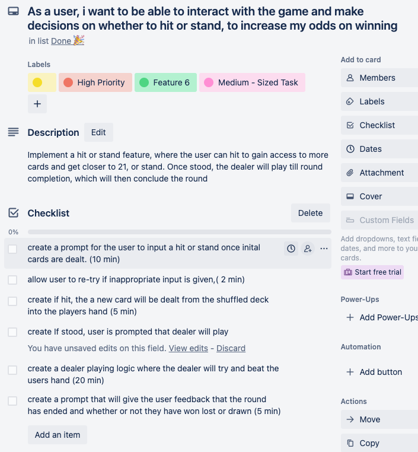

### GUI Display of Cards Feature

As outlined below, this was a high priority and big feature of this game. Actual implementation of it relative to other tasks was considered large, and took more time to implement than expected. 

There is a checklist of the steps taken to implement this user story, along with the time it would take it finish the sub tasks. (Currently unchecked for readability)

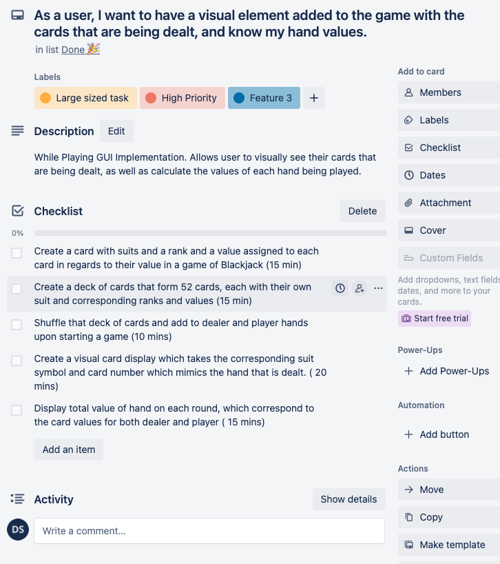

### Hit or Stand Feature

As outlined below, this was a high priority and big feature of this game. Actual implementation of it relative to other tasks was considered medium.

There is a checklist of the steps taken to implement this user story, along with the time it would take it finish the sub tasks. (Currently unchecked for readability)

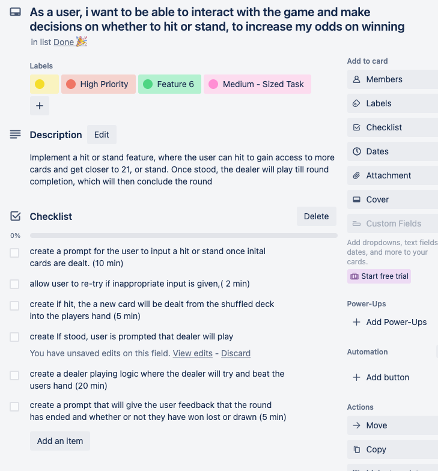

### Day by Day Implementation of Kanban Board

This was used to track the tasks that needed to be completed, on a day to day there was shuffling of the cards, sometimes into the code-review stage, then right back into the to-do stage for a different approach. This board proved very useful to making sure that the project was running smoothly. 

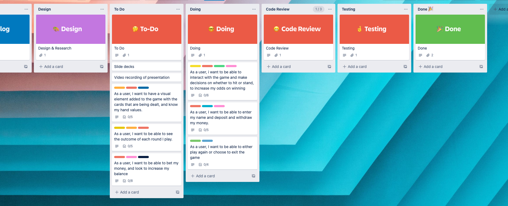
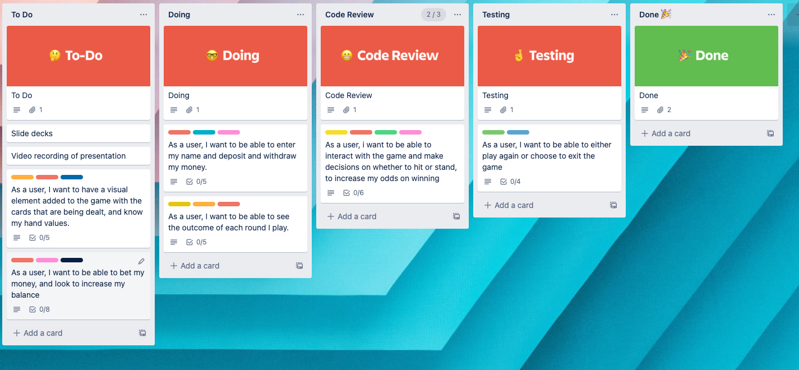
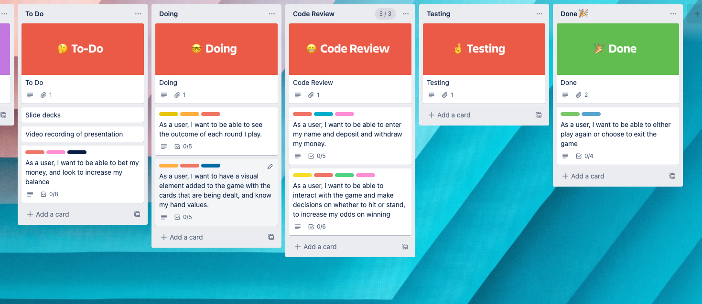
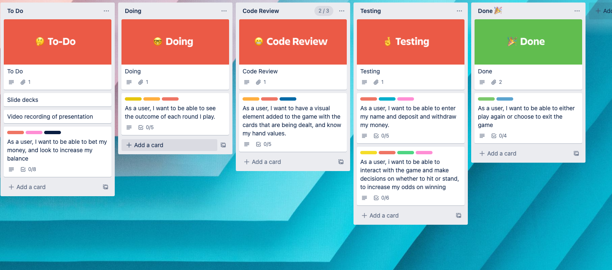
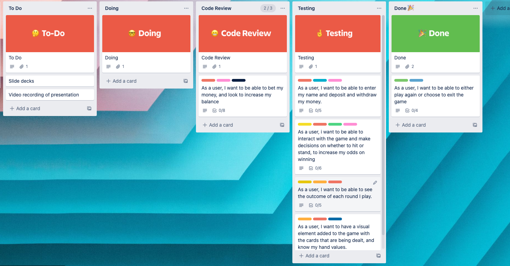
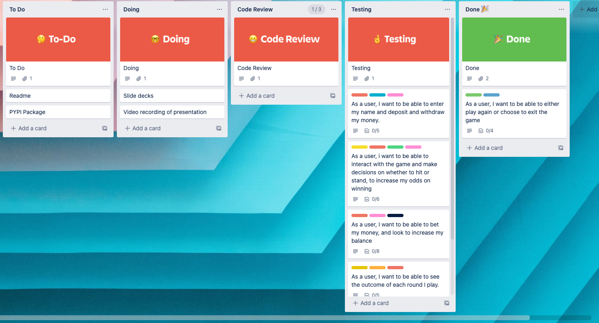
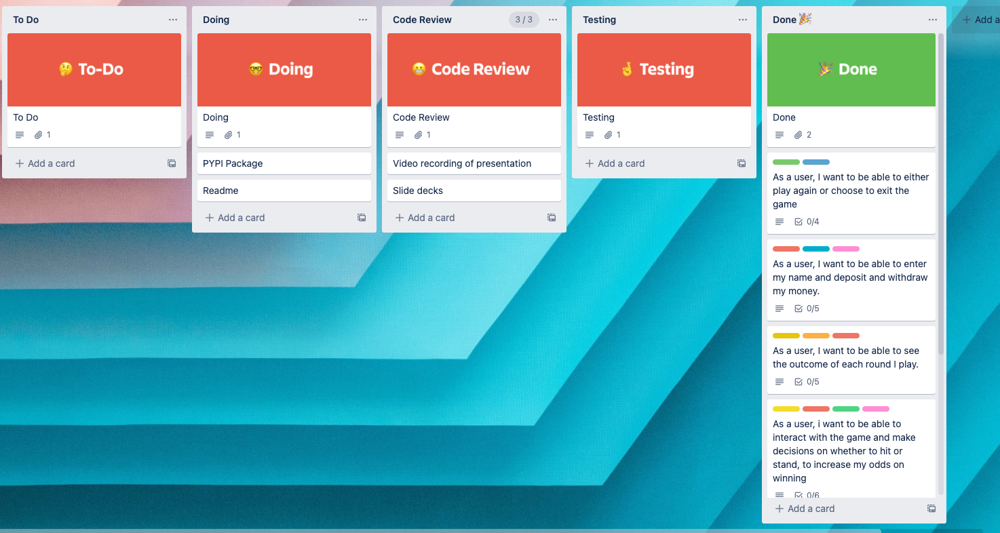
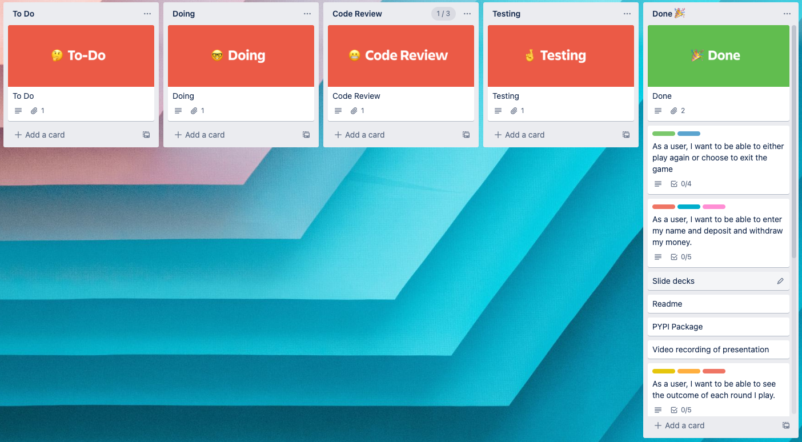

## Testing

For this project, manual testing is deployed for each of the main features.

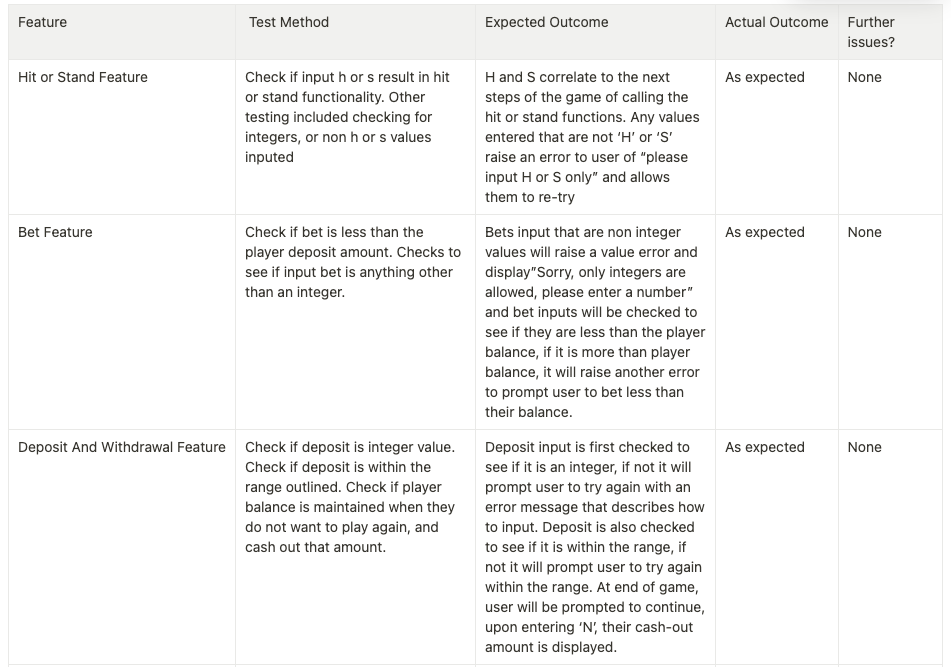
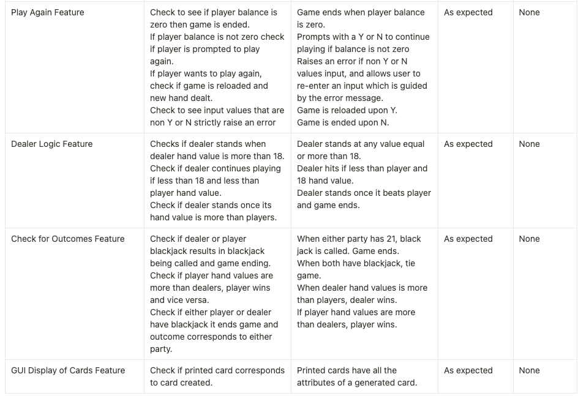

## Help Documentation

1. If you do not have Python installed on your computer or OS, please go to [page](https://www.python.org/downloads/) and install Python.
2. Please also install pip onto your computer or OS, please go to [link](https://pip.pypa.io/en/stable/installation/)
3. Clone the repository by writing the command line below
    
    `git clone https://github.com/DjSeth1/DivijSeth_T1A3`
    
4. From here we need to change into the directory src folder from the cloned repository on our local system by: `cd DivijSeth_T1A3/` `cd src/`
5. From here we can run blackjack by executing the shell script by entering the command
    
    `./main.sh`
6. From here on out, the program will guide you on how to play. 

## References

The style guide adhered to strictly has been PEP 8.
Rules obtained for logic also outlined below.

PyPI. 2022. clearing. [online] Available at: https://pypi.org/project/clearing/ [Accessed 21 September 2022].

Rossum, G., 2022. PEP 8 – Style Guide for Python Code | peps.python.org. [online] Peps.python.org. Available at: https://peps.python.org/pep-0008/ [Accessed 21 September 2022].

Encyclopedia of Casino Twenty-One, Michael Dalton, 2016, (1993), ISBN 1-879712-02-4

